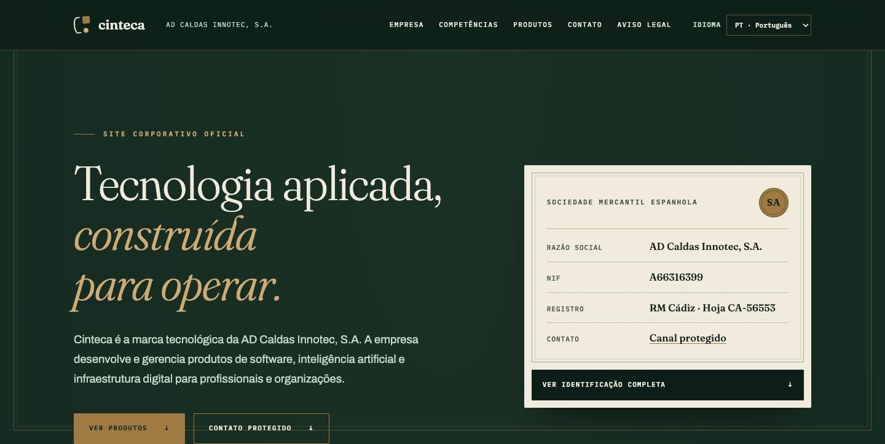
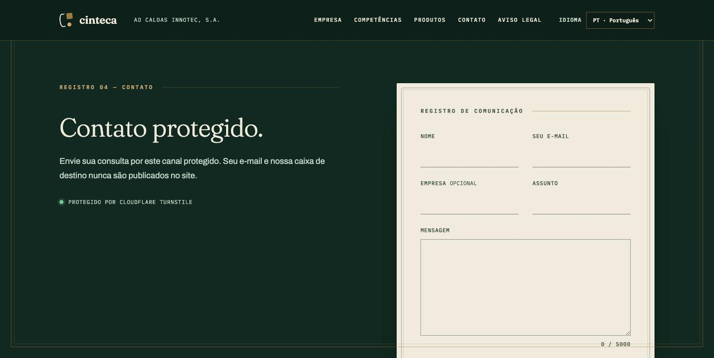

# cinteca.es

Site corporativo oficial da [Cinteca](https://cinteca.es), marca tecnológica da **AD Caldas Innotec, S.A.** (sociedade mercantil espanhola).



Identidade visual **«Registo»**: uma casa institucional em verde profundo, marfim e latão — o cartão de identidade da sociedade apresenta-se como certificado com selo, as secções como folhas de registo e os produtos como cartões-certificado.



## Características

- **Next.js 16** (App Router) com exportação estática — sem servidor, sem banco de dados, sem cookies, sem analytics;
- **4 idiomas** (pt · en · es · nb) com deteção pelo navegador e seleção manual via `?lang=`;
- **Contato protegido**: Cloudflare Turnstile + honeypot + Lambda de envio — sem e-mail publicado;
- **Conformidade**: aviso legal (art. 10 da Lei espanhola 34/2002 — LSSI) e política de privacidade integrados;
- **Acessibilidade**: contraste WCAG AA documentado no CSS, foco visível, animações sob `prefers-reduced-motion`;
- **JSON-LD** (Organization/Brand/WebSite), sitemap e robots;
- Testes de conteúdo que validam o HTML renderizado, o inventário de competências (13 domínios · 195 competências) e o contrato do formulário.

## Desenvolvimento local

Requer Node.js 22.13 ou superior.

```bash
npm install
npm run dev
```

Para o formulário funcionar localmente, copie `.env.example` para `.env.local` e defina `NEXT_PUBLIC_TURNSTILE_SITE_KEY` (em localhost é usada automaticamente a chave de teste do Turnstile).

## Validação

```bash
npm test           # build + testes de conteúdo
npm run lint
npm audit
```

## Publicação

```bash
npm run build:s3   # gera out/ (exportação estática)
```

O conteúdo de `out/` é publicado como site estático (S3 + CloudFront) no domínio `cinteca.es`.
